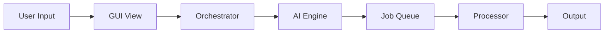

# 🏗️ Architecture Overview

Technical documentation for developers working on AgencyOS.

---

## Project Structure

```
src/social_media_manager/
├── ai/                 # AI engines (45+ modules)
│   ├── brain.py        # HybridBrain - main LLM interface
│   ├── director.py     # Video editing AI
│   ├── producer.py     # Full production pipeline
│   ├── composer.py     # Music generation
│   └── ...
│
├── core/               # Business logic (30 modules)
│   ├── orchestrator.py # Main workflow coordinator
│   ├── processor.py    # Video/audio processing
│   ├── scheduler.py    # Content scheduling
│   └── ...
│
├── gui/                # Desktop GUI (PyQt6)
│   ├── main.py         # Application entry point
│   ├── sidebar.py      # Navigation sidebar
│   ├── styles.py       # Theme system
│   ├── views/          # 8 main views
│   └── widgets/        # Reusable components
│
├── platforms/          # Social media integrations
│   └── uploader.py     # Multi-platform publishing
│
├── plugins/            # Plugin system
│   ├── loader.py       # Plugin discovery
│   └── base.py         # BaseToolPlugin class
│
├── config.py           # Configuration management
├── database.py         # ORM and database
├── job_queue.py        # Background job system
└── container.py        # Dependency injection
```

---

## Core Components

### HybridBrain (`ai/brain.py`)

Central AI interface with multi-provider fallback:

```python
from social_media_manager.ai.brain import HybridBrain

brain = HybridBrain()
result = brain.complete("Generate a video script about...")
```

Provider chain: Gemini → Groq → Ollama

---

### Orchestrator (`core/orchestrator.py`)

Coordinates multi-step workflows:

```python
from social_media_manager.core.orchestrator import SocialMediaManager

manager = SocialMediaManager()
manager.produce_video(script, style="cinematic")
```

---

### Job Queue (`job_queue.py`)

Thread-safe background job processing:

```python
from social_media_manager.job_queue import JobQueue

queue = JobQueue()
job_id = queue.submit("video_process", {"input": "video.mp4"})
```

---

### Container (`container.py`)

Dependency injection container:

```python
from social_media_manager.container import Container

container = Container()
brain = container.brain()
```

---

## Database Models

Using SQLAlchemy ORM (`models.py`):

| Model | Purpose |
|-------|---------|
| `JobModel` | Background job tracking |
| `ContentModel` | Stored content metadata |
| `ScheduleModel` | Scheduled posts |
| `AssetModel` | Media library items |

---

## GUI Architecture

### View System

```
MainWindow
├── Sidebar (navigation)
└── QStackedWidget
    ├── DashboardView
    ├── ContentStudioView
    ├── MediaLibraryView
    ├── AutomationView
    ├── StrategyView
    ├── AIToolsView
    ├── JobQueueView
    └── SettingsView
```

### Async Operations

PyQt6 + `qasync` for non-blocking AI calls:

```python
from social_media_manager.gui.async_utils import run_async

async def generate():
    result = await brain.complete_async(prompt)

run_async(generate())
```

---

## Plugin System

Create custom tools by implementing `BaseToolPlugin`:

```python
from social_media_manager.plugins import BaseToolPlugin, PluginMetadata

class MyPlugin(BaseToolPlugin):
    metadata = PluginMetadata(
        name="My Tool",
        icon="🔧",
        category="writing"
    )

    def get_widget(self):
        return MyWidget()

    def execute(self, **kwargs):
        return {"result": "done"}
```

See [PLUGINS.md](../PLUGINS.md) for full guide.

---

## Data Flow



---

## Key Design Decisions

1. **Multi-provider LLM** — Fallback chain ensures reliability
2. **Background Jobs** — Non-blocking GUI with queue system
3. **Dependency Injection** — Testable, modular components
4. **Plugin Architecture** — Extensible tool system
5. **ORM-based Data** — SQLAlchemy for database operations
